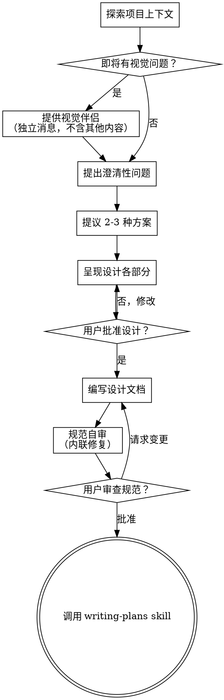

# 将创意构思为设计方案

通过自然的协作对话，将想法转化为完整的设计和规范。

首先了解当前项目上下文，然后逐一提问以完善创意。一旦理解了你要构建的内容，呈现设计方案并获取用户批准。

<HARD-GATE>
在呈现设计方案并获得用户批准之前，不得调用任何实现类 skill、编写任何代码、搭建任何项目或采取任何实现行动。这适用于每个项目，无论其被认为多么简单。
</HARD-GATE>

## 反模式："这个太简单了，不需要设计"

每个项目都要经历这个过程。待办事项列表、单函数工具、配置变更——无一例外。"简单"项目恰恰是未经检视的假设造成最多浪费工作的地方。设计可以很短（对于真正简单的项目只需几句话），但你必须呈现它并获得批准。

## 检查清单

你必须为以下每一项创建任务并按顺序完成：

1. **探索项目上下文**——检查文件、文档、最近的提交
2. **提供视觉伴侣**（如果话题涉及视觉问题）——这必须是一条独立消息，不与澄清性问题合并。参见下方"视觉伴侣"章节。
3. **提出澄清性问题**——逐一提问，理解目标、约束和成功标准
4. **提议 2-3 种方案**——说明权衡利弊并给出你的推荐
5. **呈现设计**——按各部分复杂度缩放篇幅，每部分后获取用户批准
6. **编写设计文档**——保存到 `docs/specs/YYYY-MM-DD-<topic>-design.md` 并提交
7. **规范自审**——快速内联检查占位符、矛盾、歧义和范围（见下文）
8. **用户审查书面规范**——请用户审查规范文件后再继续
9. **过渡到实现**——调用 writing-plans skill 创建实现计划

## 流程

**最终状态是调用 writing-plans。** 不要调用 frontend-design、mcp-builder 或任何其他实现类 skill。brainstorming 之后唯一能调用的 skill 是 writing-plans。

## 流程详解

**理解创意：**

- 首先检查当前项目状态（文件、文档、最近的提交）
- 在提出详细问题之前，评估范围：如果需求描述涉及多个独立子系统（例如"构建一个包含聊天、文件存储、计费和分析的平台"），立即标记出来。不要花时间去细化一个需要先分解的大项目的细节
- 如果项目过大无法放在单个规范中，帮助用户分解为子项目：哪些是独立部分、它们如何关联、应按照什么顺序构建。然后通过正常设计流程对第一个子项目进行 brainstorming。每个子项目都有自己独立的 spec → plan → 实现循环
- 对于范围适中的项目，逐一提问以完善创意
- 尽可能使用选择题，但开放式问题也可以
- 每条消息只提一个问题——如果某个话题需要更多探讨，将其拆分为多个问题
- 聚焦于理解：目标、约束、成功标准

**探索方案：**

- 提出 2-3 种不同方案，说明各自的权衡利弊
- 以对话方式呈现选项，附上你的推荐和理由
- 从推荐选项开始，解释原因

**呈现设计：**

- 一旦你确信自己理解了要构建的内容，呈现设计方案
- 按各部分的复杂度缩放篇幅：简单的几句话即可，复杂的可长达 200-300 字
- 每个部分后询问用户目前看起来是否正确
- 涵盖：架构、组件、数据流、错误处理、测试
- 准备好返回并澄清不合理的部分

**为隔离性和清晰性而设计：**

- 将系统拆分为更小的单元，每个单元有明确的职责，通过定义良好的接口通信，可以独立理解和测试
- 对于每个单元，你应当能够回答：它做什么、如何使用它、它依赖什么？
- 其他人能否在不阅读内部实现的情况下理解一个单元的职责？能否在不破坏调用方的前提下更改内部实现？如果不能，边界需要重新设计
- 更小、边界清晰的单元也更容易与你协作——你能更好地推理那些可以一次性放在上下文中的代码，当文件聚焦时你的编辑也更可靠。当文件变得庞大时，通常是它做的事情太多的信号

**在现有代码库中工作：**

- 在提出更改之前探索当前结构。遵循现有模式
- 如果现有代码存在影响工作的问题（例如文件变得过大、边界不清晰、职责纠缠不清），将有针对性改进纳入设计——就像一名优秀的开发者会改进他们正在接触的代码一样
- 不要提出不相关的重构。专注于服务于当前目标

## 设计之后

**文档化：**

- 将验证通过的设计（规范）写入 `docs/specs/YYYY-MM-DD-<topic>-design.md`
  - （用户对规范位置的偏好会覆盖此默认值）
- 如果可用，使用 elements-of-style:writing-clearly-and-concisely skill
- 将设计文档提交到 git

**规范自审：**
编写完规范文档后，用全新的视角审视它：

1. **占位符扫描：** 是否存在"TBD"、"TODO"、不完整的章节或模糊的需求？修复它们。
2. **内部一致性：** 各章节之间是否存在矛盾？架构是否与功能描述匹配？
3. **范围检查：** 这个规范的焦点是否足够集中以用于单个实现计划，还是需要分解？
4. **歧义检查：** 是否存在可以用两种不同方式解读的需求？如果有，选择一种并明确说明。

内联修复所有问题。无需重新审查——直接修复并继续。

**用户审查关卡：**
规范审查循环通过后，请用户审查书面规范后再继续：

> "规范已编写并提交到 `<path>`。请审阅，如果希望在开始编写实现计划之前做任何修改，请告知。"

等待用户回复。如果他们要求修改，进行修改并重新运行规范审查循环。只有在用户批准后方可继续。

**实现：**

- 调用 writing-plans skill 创建详细的实现计划
- 不要调用任何其他 skill。writing-plans 是下一步。

## 关键原则

- **一次只问一个问题**——不要用多个问题让人应接不暇
- **优先使用选择题**——在可能的情况下比开放式问题更容易回答
- **严格执行 YAGNI**——从所有设计中移除不必要的功能
- **探索替代方案**——在确定方案前始终提出 2-3 种选择
- **增量验证**——呈现设计，在继续前获得批准
- **保持灵活**——当某些内容不合理时，返回并进行澄清

## 视觉伴侣

一种基于浏览器的伴侣工具，用于在 brainstorming 期间展示原型图、图表和视觉选项。作为一种可用工具而非模式。接受伴侣意味着在那些能从视觉呈现中获益的问题上可以使用它；但这并不意味着每个问题都要通过浏览器处理。

**提供伴侣：** 当你预计接下来的问题涉及视觉内容（原型图、布局、图表）时，一次性提供并获得同意：
> "我们正在做的某些工作如果我能通过网页浏览器展示给你，可能会更容易解释。我可以随着进展准备原型图、图表、对比和其他视觉效果。这个功能还比较新，并且可能消耗较多 token。想试试吗？（需要打开本地 URL）"

**这个提议必须是一条独立消息。** 不要将其与澄清性问题、上下文总结或任何其他内容合并。这条消息应只包含上述提议，不包含其他任何内容。等待用户回复后再继续。如果他们拒绝，则继续纯文本形式的 brainstorming。

**逐问题决策：** 即使接受了伴侣，也要对每个问题单独决定是使用浏览器还是终端。判断标准是：**用户通过看到它是否会比通过阅读它理解得更好？**

- **使用浏览器**处理本质上是视觉的内容——原型图、线框图、布局对比、架构图、并排视觉设计
- **使用终端**处理文本类内容——需求问题、概念性选择、权衡列表、A/B/C/D 文本选项、范围决策

关于 UI 话题的问题并不自动等同于视觉问题。"在此上下文中'个性'是什么意思？"是概念性问题——使用终端。"哪种向导布局效果更好？"是视觉问题——使用浏览器。

如果用户同意使用伴侣，在继续前阅读详细指南：
`skills/brainstorming/visual-companion.md`
